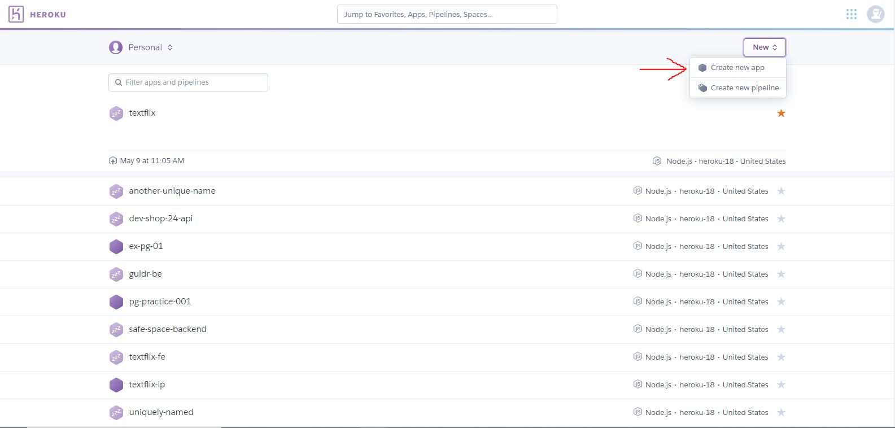
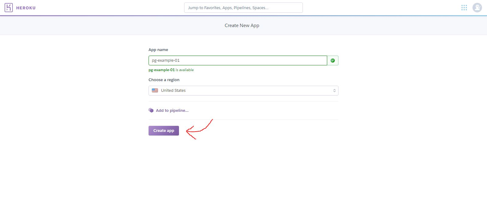
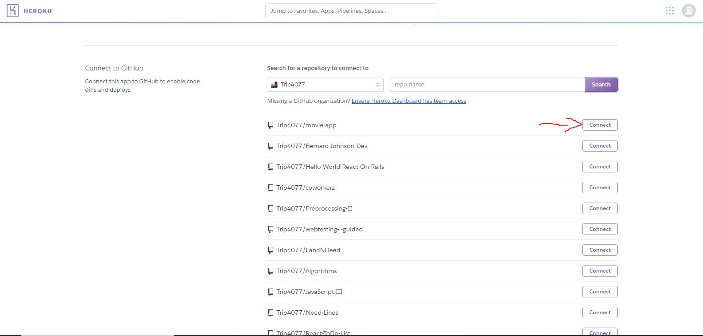
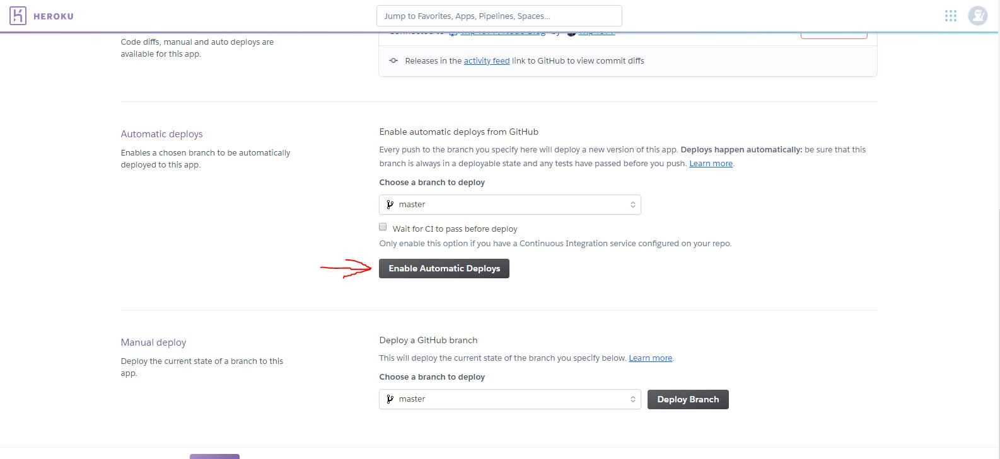
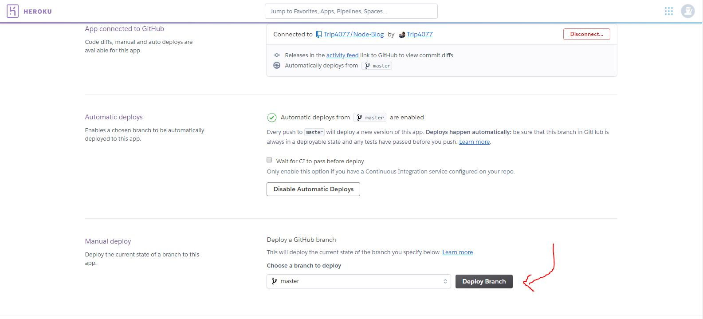
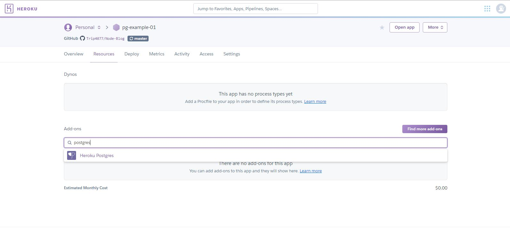
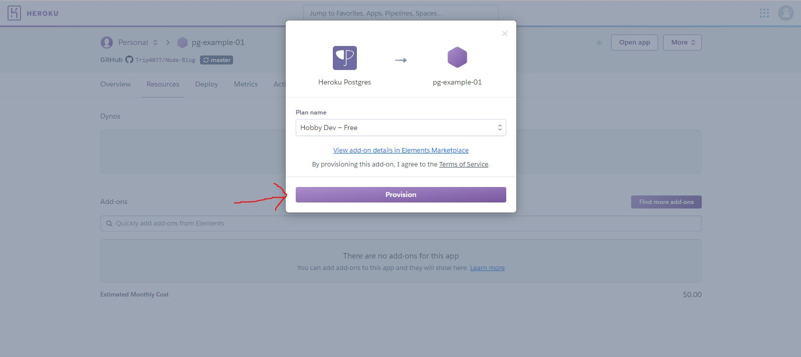

# PostgreSQL Deployment

## Step 1 
- Ensure Everything Works Locally

## Step 2 
- Add 'pg' as dependency

`yarn add pg` 

or 

`npm install pg`

## Step 3 
- configure knexfile file for production
```
  production: {
    client: "pg",
    connection: process.env.DATABASE_URL,
    migrations: { directory: "./data/migrations" },
    seeds: { directory: "./data/seeds" }
  }
```

## Step 3.5 (if not done prior) 
- configure dbConfig file for production
```
require('dotenv').config();

const knex = require("knex");
const config = require("../knexfile.js");
const environment = process.env.DB_CONNECT || "development";

module.exports = knex(config[environment]);
```

## Step 4 
- Make sure everything is pushed to master

## Step 5 
- Create a new heroku app



## Step 6 
- Connect to Github Repo



## Step 7 
- Deploy and Enable Auto Deployment



## Step 8 
- Ensure Deployment Was Successful

## Step 9 
- Go To Resources Tab of Heroku App


- Under Add-ons find Heroku Postgres



- choose free version and click provision


## Step 10
### Configure ENV variables

- Go to settings tab


- Click Reveal Config Vars


- Set DB_CONNECT to production


- Set any other needed ENV variables

## Step 11 
- Check routes to ensure connection to PG DB, SHOULD get an error

## Step 12 
- run migrations on heroku via 

	`npx heroku run knex migrate:latest --app your_heroku_app_name`

## Step 12.5 (optional) 
- run seeds on heroku via 

	`npx heroku run knex seed:run --app your_heroku_app_name`

## Step 13 
- Check routes to ensure connection to PG DB, SHOULD NOT get an error
