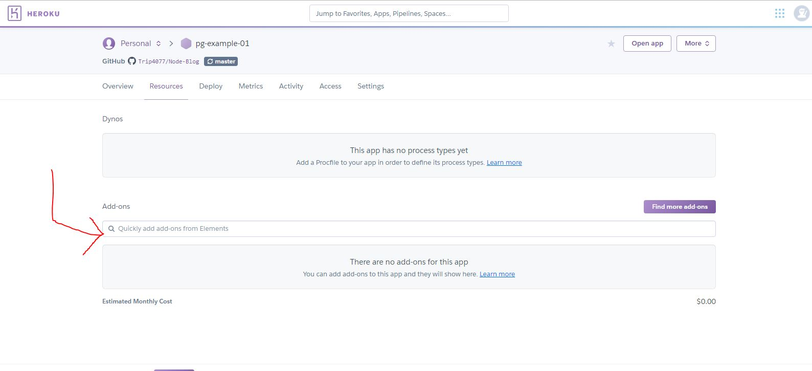
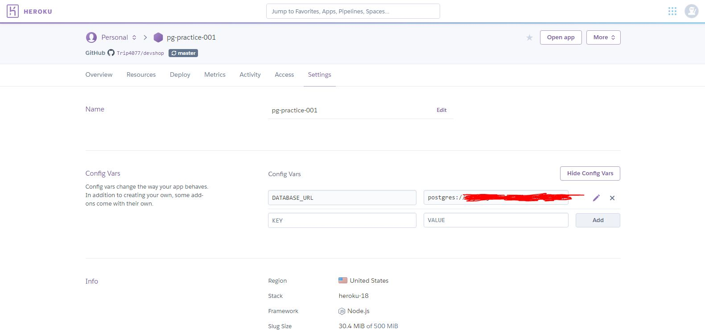

# Authentication Project

## Topics

- Authentication.
- Express Middleware.
- Password Hashing.
- Sessions
- Cookies

## Description

Use `Node.js`, `Express` and `Knex` to build an API that provides **Register** and **Login** functionality using `SQLite` to store _User_ information. Make sure the password is not stored as plain text.

## Assignment

This project will be completed over two days.

## Part 1, due after completing the first module.

### Complete the following endpoints:

| Method | Endpoint      | Description                                                                                                                                                                                                                                                                                         |
| ------ | ------------- | --------------------------------------------------------------------------------------------------------------------------------------------------------------------------------------------------------------------------------------------------------------------------------------------------- |
| POST   | /api/register | Creates a `user` using the information sent inside the `body` of the request. **Hash the password** before saving the user to the database.                                                                                                                                                         |
| POST   | /api/login    | Use the credentials sent inside the `body` to authenticate the user. On successful login, create a new session for the user and send back a 'Logged in' message and a cookie that contains the user id. If login fails, respond with the correct status code and the message: 'You shall not pass!' |
| GET    | /api/users    | If the user is logged in, respond with an array of all the users contained in the database. If the user is not logged in repond with the correct status code and the message: 'You shall not pass!'.                                                                                                |

## Part 2, due after completing the second module.

Add support for **sessions** and **cookies**, use them to keep a record of logged in users across requests.

## Stretch Problem

- Write a piece of **global** middleware that ensures a user is logged in when accessing _any_ route prefixed by `/api/restricted/`. For instance, `/api/restricted/something`, `/api/restricted/other`, and `/api/restricted/a` should all be protected by the middleware; only logged in users should be able to access these routes.
- Build a React application that implements components to register, login and view a list of users. Gotta keep sharpening your React skills.


# PostgreSQL Deployment

## Step 1 
- Ensure Everything Works Locally

## Step 2 
- Add 'pg' as dependency

`yarn add pg` 

or 

`npm install pg`

## Step 3 
- configure knexfile file for production
```
  production: {
    client: "pg",
    connection: process.env.DATABASE_URL,
    migrations: { directory: "./data/migrations" },
    seeds: { directory: "./data/seeds" }
  }
```

## Step 3.5 (if not done prior) 
- configure dbConfig file for production
```
require('dotenv').config();

const knex = require("knex");
const config = require("../knexfile.js");
const environment = process.env.DB_CONNECT || "development";

module.exports = knex(config[environment]);
```

## Step 4 
- Make sure everything is pushed to master

## Step 5 
- Create a new heroku app


## Step 6 
- Connect to Github Repo


## Step 7 
- Deploy and Enable Auto Deployment


## Step 8 
- Ensure Deployment Was Successful

## Step 9 
- Go To Resources Tab of Heroku App


- Under Add-ons find Heroku Postgres



- choose free version and click provision


## Step 10
### Configure ENV variables

- Go to settings tab


- Click Reveal Config Vars



- Set DB_CONNECT to production


- Set any other needed ENV variables

## Step 11 
- Check routes to ensure connection to PG DB, SHOULD get an error

## Step 12 
- run migrations on heroku via 

	`npx heroku run knex migrate:latest --app your_heroku_app_name`

## Step 12.5 (optional) 
- run seeds on heroku via 

	`npx heroku run knex seed:run --app your_heroku_app_name`

## Step 13 
- Check routes to ensure connection to PG DB, SHOULD NOT get an error
